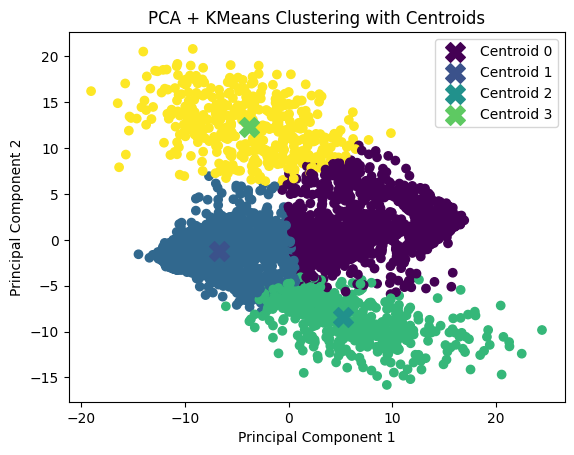
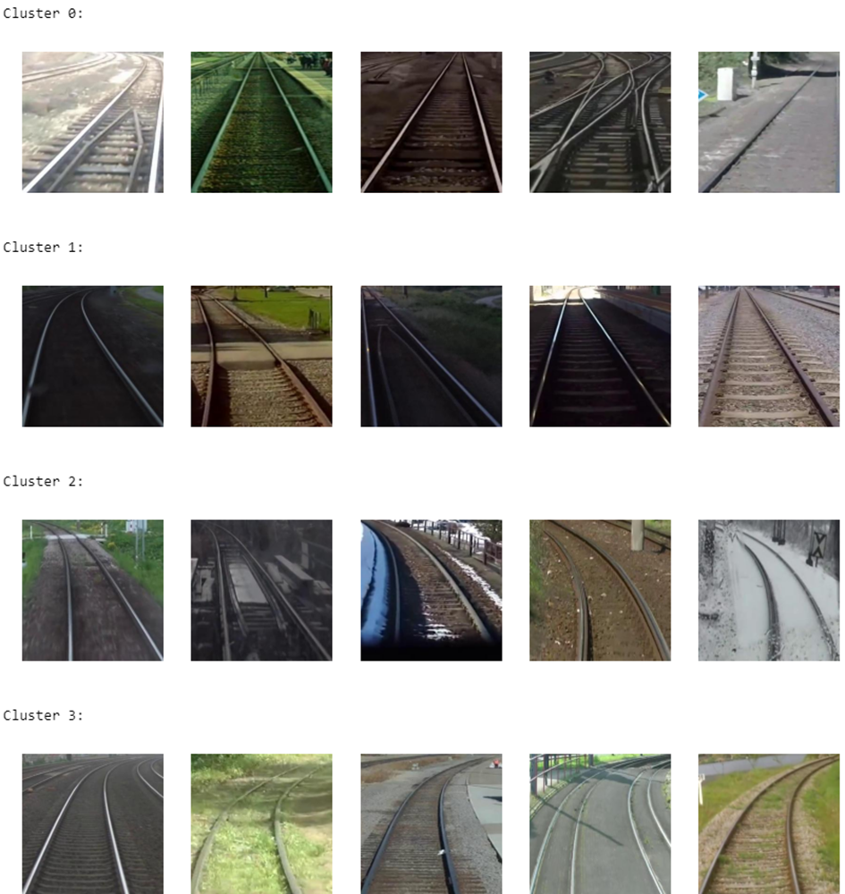

# Orientation_Rail

<!-- ABOUT THE PROJECT -->
## About The Project
The principal objectif is to cluster the rail image according to their path annotation and to create a model that can predict the orientation of the rails. This project may be intressing for the automone trains to follow the rails.
## Roadmap
[automatic_crop_ego_path](/automatic_crop_ego_path.py) : This script based on a another projet (https://github.com/irtrailenium/train-ego-path-detection), it is used to crop the ego path. The dataset and the neura net work model is explained in this projet page and the corresponding paper. The dataset can be downloaded from (https://www.wilddash.cc/railsem19).Three methods are available, even the most adequat method 'regression' failed to extract the ego rail path in some complexe situations. A muanul slection need to be done to deleate the wrongly extracted path. 

[rail_points](/rail_points.json) : Finnaly, a list of points that are used to generate the rail path after the process explained in automatic_crop_ego_path. It's provided by the author of the projet (https://github.com/irtrailenium/train-ego-path-detection).Its named rs19_ego_path.json in the related projet. It will be the dataset of this current projet. 

[preprocessing](/preprocessing.ipynb): This notebook is used to preprocess the rail_points and the images. Each pair of the rails contains differental numbers of points, and each image process differental sizes of the images. This notebook crop the area of ​​interest according the rail coordinates then resize them to the same dimension 300 * 300. This notebook also interpolats the rail coordinates with the same numbers of the points: 50 points for the left rail, and 50 points for the right rail. Each point has two dimension x and y. Thus, there are 200 values for each image. All the values are put into a csv file 'rail.csv'. 

[processing](/processing.ipynb) : This notebook tried to use diffrent methods of dimension reduction to reduce the dimension of the csv file. The methods used are PCA, MDS, and TSNE and diffrent methods of clustering Hierarchical Agglomerative Clustering (CAH) and KMeans. The results are shown in the notebook. The objectif is to clustering the images into three principal clusters, curve to left, direct ligne and curve to right.

[optimisation_pca_ego_path](/optimisation_pca_ego_path.ipynb) : Finally, the metrics silhouette_score is choosen for the method KMeans. This metrics seems to present the best the forme of the rails. A process of optimisation is done by the grid_serach of the combination of PCA + Kmeans. The results are shown in the notebook. The curvs to left and right are well separated. And the two parts are symetrically situated, have allmost the same forms. The direct line are seperated to two clusters, this is because the directe ligne is usually accompanyed by a curve to left or right. And the rails points may rather concentered to the left of part of the image, this bias the separation.  

[optimisation_tsne_ego_path](/optimisation_tsne_ego_path.ipynb) : The same thing is done with t-SNE + KMeans. But the result is not good as the PCA + KMeans.
